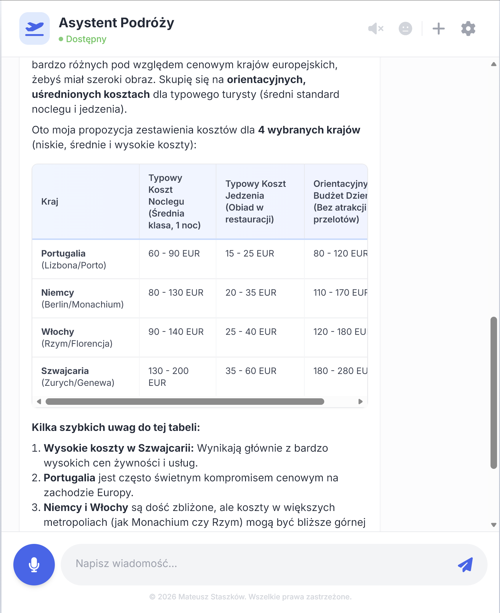

# ✈️ Empathetic AI Travel Assistant

<div align="center">
  
  
  
</div>

<br />

> **Your personal travel planner that senses your emotions.**

<!-- --- SCREENSHOTS SECTION START --- -->
<div align="center">
  <h3>📸 Interface Preview</h3>
  <table style="border: none;">
    <tr>
      <td align="center" style="border: none;">
        
        <br />
      </td>
      <td align="center" style="border: none;">
        
        <br />
      </td>
    </tr>
  </table>
</div>
<br />
<!-- --- SCREENSHOTS SECTION END --- -->

## 📖 About The Project

This project is an AI-powered travel assistant designed to plan the perfect trip based on your preferences, budget, and logistical needs.

**Current Status:**
The application operates as a Hybrid System. The Backend (Python) processes audio, detects emotions (using Wav2Vec), and transcribes speech (Whisper), while the Frontend (React) provides a modern chat interface. The **Google Gemini** model acts as the reasoning engine.

### ✨ Key Features

- 🎤 **Advanced Voice Interface:** Uses Web Speech API or OpenAI Whisper for accurate speech-to-text.
- 🧠 **Emotion Recognition (SER):** Detects if you are happy, sad, or uncertain to adjust the travel advice accordingly.
- ⚡ **Real-time Responses:** Powered by Google Gemini Flash Lite.
- 🎨 **Modern UI:** Built with Tailwind CSS for a clean, responsive experience.

---

## 🛠️ Tech Stack

### Backend
- **Core:** Python 3.10+, Flask
- **Speech-to-Text:** OpenAI Whisper
- **Emotion Analysis:** HuggingFace Transformers (Wav2Vec)
- **Tools:** FFmpeg, NumPy

### Frontend
- **Core:** React 19, TypeScript, Vite
- **Styling:** Tailwind CSS
- **API:** Web Speech API (Input fallback)
---

## 🚀 Run Locally

Follow these steps to get the project running on your local machine.

### Prerequisites

- **Node.js** (Version 18+ or 20+).
- **Python** (Version 3.10+).
- A valid **Google Gemini API Key** (Get it for free [here](https://aistudio.google.com/app/apikey)).
- *Optional:* **FFmpeg** installed on your system.
  *(The automatic script will try to install a portable version if you don't have it, but having it installed system-wide is recommended).*

### Installation

1. **Clone the repository**

   ```bash
   git clone https://github.com/stvshy/empathetic-ai-travel-assistant.git
   cd empathetic-ai-travel-assistant
   ```

2. **Configure Environment Variables**
   Create a file named `.env` in the `backend` directory (or root) and add your API key:

   ```env
   GEMINI_API_KEY=AIzaSy...Your_Actual_Key_Here
   ```

---

### ⚡ Option 1: One-Click Start (Windows Recommended)

The project includes a smart script that sets up the virtual environment, installs dependencies (including FFmpeg if missing), and launches both servers automatically.

1. **Run the script:**
   Double-click `start.bat` in the file explorer, or run it via terminal in the project folder:
   ```powershell
   .\start.bat
   ```

2. **That's it!**
   Two terminal windows will open (Backend & Frontend). The app will open in your browser at `http://localhost:3000`.

---

### 🛠️ Option 2: Manual Setup (Mac/Linux/Windows)

Use this method if you are on macOS/Linux or prefer to have full control over the execution.

#### 1. Backend Setup
```bash
cd backend

# Create virtual environment
python -m venv venv

# Activate Virtual Environment:
# Windows:
venv\Scripts\activate
# Mac/Linux:
source venv/bin/activate

# Install dependencies
pip install -r requirements.txt

# Run Server
python app.py
```

#### 2. Frontend Setup
Open a new terminal window:
```bash
cd frontend

# Windows PowerShell only (if script errors occur):
Set-ExecutionPolicy RemoteSigned -Scope CurrentUser

npm install
npm run dev
```

---

## ⚙️ Configuration

### Changing the Gemini Model

The model configuration is handled in `backend/app.py`.
To change the model, locate the `generate_gemini_response` function and update the `model` parameter:

```python
# backend/app.py

response = client.models.generate_content(
    model='gemini-flash-lite-latest', # <--- Change model name here
    contents=final_input,
    config=types.GenerateContentConfig(
        system_instruction=system_instruction,
        temperature=0.7,
    )
)
```

Common model names:
- `gemini-2.0-flash-exp` (Fast & Smart - Experimental)
- `gemini-1.5-flash` (Stable & Fast)
- `gemini-1.5-pro` (Reasoning-heavy, slightly slower)

---

## 🗺️ Roadmap

- [x] **Sprint 1:** Core UI & LLM Integration.
- [x] **Sprint 2:** Python Backend & Whisper Integration.
- [x] **Sprint 3:** Emotion Recognition (Wav2Vec) & Logic.
- [ ] **Sprint 4:** Server-side Text-to-Speech (Piper) & Final Polish.

---

## 📄 License

Distributed under the MIT License.
```
